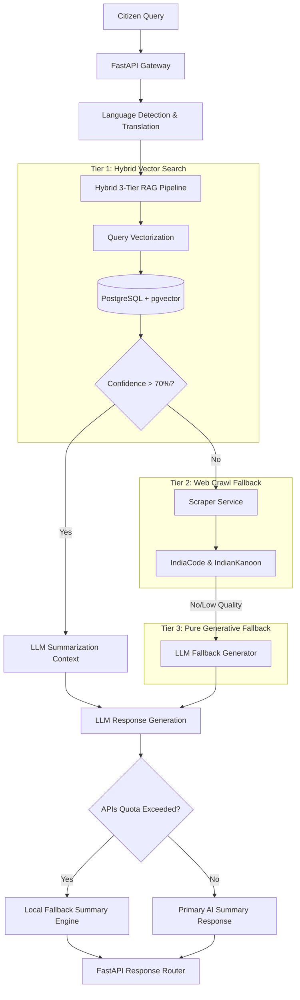

# LexIndia Backend — AI-Powered Indian Legal Access API

The backend for **LexIndia** is a high-performance Python FastAPI service providing vector-based search, translation, and structured summarization of Indian Laws. It empowers citizens to query legal issues in plain language (English, Hindi, or Tamil) and receive simplified, context-aware legal references alongside official eCourts filing details.

---

## 🏛️ System Architecture



---

## ⚙️ Key Technical Features

### 1. Hybrid 3-Tier RAG Execution
To guarantee that the user *always* receives a valid response regardless of system load or missing data, the RAG engine scales across three fallback stages:
* **Tier 1 (Vector DB)**: Computes cosine distance using `all-MiniLM-L6-v2` embeddings over the local database. If the top results cross the relevance threshold, they are formatted directly.
* **Tier 2 (Web Crawl)**: If database relevance is low, the backend triggers concurrent requests to `indiacode.nic.in` (official laws portal) and `indiankanoon.org` (case precedents) to enrich the search window.
* **Tier 3 (LLM Generative)**: If both DB and crawl fail, it generates general guidance using direct reasoning.

### 2. Multi-LLM Fallback Chain
We configure a primary and secondary LLM pipeline utilizing standard environments:
* **OpenAI (GPT-4o)** $\rightarrow$ **Google Gemini (Gemini-2.0-Flash)** $\rightarrow$ **xAI (Grok-Beta)**.
If any provider raises quota warnings, rate limits, or credentials exceptions, the system transitions to the next client in sequence, logging exact exception types for diagnostic purposes.

### 3. Local Summary Fallback Engine
When all cloud-based LLM APIs fail (e.g., due to API quota exhaustion or network downtime), the backend falls back to a locally executed summarization engine (`generate_fallback_summary`). It maps metadata attributes and simplified text from the top 3 retrieved sections into a cohesive markdown list:
```text
Based on your query about '[Query]', the following laws may apply:
1. [Act Name] Section [Section Number] — [Section Title]
   [Simplified text or main provision]
```

### 4. Dynamic IPv6 Resolver
Includes an automated DNS/IPv6 fallback resolver in `config.py`. If a Supabase/PostgreSQL connection string resolves to an IPv6-only host and the local environment experiences DNS resolution timeouts, the system queries Google Public DNS over port 53 to resolve and build connection wrappers dynamically.

---

## 📂 Project Structure

```text
backend/
├── app/
│   ├── models/            # SQLAlchemy database schemas (Law, FilingLink)
│   ├── routers/           # FastAPI routers (laws, query, health, draft)
│   ├── schemas/           # Pydantic validation schemas (LawSchema, QueryRequest)
│   ├── services/          # Business logic orchestrators (RAG, Cache, Embed)
│   │   ├── cache_service.py
│   │   ├── embed_service.py
│   │   ├── generate_service.py     # LLM multi-provider fallback logic
│   │   ├── rag_service.py          # Vector search + RAG pipeline orchestrator
│   │   └── translate_service.py    # DeepL/LLM multi-lingual translation
│   └── database.py        # Database session and engine managers
├── setup/                 # Initial migration and vector embedding scripts
├── seed_*.py              # Individual transactional seed files for 40 Acts
├── seed_all.py            # Master seed runner orchestrating database insertions
└── main.py                # FastAPI main application gateway
```

---

## 🛠️ Installation & Setup

### Prerequisites
* Python 3.10 or 3.11
* PostgreSQL database with the `pgvector` extension enabled
* Redis server (optional, for caching layer)

### Step 1: Environment Variables
Create a `.env` file in the `backend/` directory:
```env
DATABASE_URL="postgresql+asyncpg://<username>:<password>@<host>:<port>/<dbname>"
OPENAI_API_KEY="your-openai-api-key"
GEMINI_API_KEY="your-gemini-api-key"
REDIS_URL="redis://localhost:6379"
SIMILARITY_THRESHOLD=0.20
MAX_RESULTS=8
```

### Step 2: Set up Virtual Environment
```bash
python -m venv venv
venv\Scripts\activate      # On Windows
source venv/bin/activate  # On macOS/Linux
pip install -r requirements.txt
```

### Step 3: Populate Database
We provide a complete seeding orchestrator covering **40 major Indian Acts** with **1,000+ total translated sections**:
```bash
python seed_all.py
```

### Step 4: Generate Embeddings
Vectorize all seeded law text for similarity searches:
```bash
python setup/generate_embeddings.py
```

### Step 5: Start the Server
```bash
uvicorn app.main:app --reload
```
The server will start on `http://127.0.0.1:8000`. API documentation is available at `/docs` (Swagger UI).

---

## 🔗 Endpoint Reference

### 1. Match Law Query
* **URL**: `/api/query`
* **Method**: `POST`
* **Headers**: `Content-Type: application/json`
* **Request Body**:
  ```json
  {
    "issue": "my landlord is refusing to return my security deposit",
    "language": "en",
    "mode": "citizen"
  }
  ```
* **Success Response (200 OK)**:
  ```json
  {
    "query_id": "48c42e5c-0230-4100-8ffd-d3577f351ad1",
    "detected_language": "en",
    "ai_summary": "Based on your query about 'my landlord is not returning my security deposit', the following laws may apply:\n\n1. **Transfer of Property Act, 1882 Section 108** — Rights and liabilities of lessor and lessee...",
    "laws": [
      {
        "section_id": "TPA-108",
        "act_name": "Transfer of Property Act, 1882",
        "act_code": "TPA",
        "section_number": "108",
        "relevance_score": 0.53,
        "severity": "medium"
      }
    ],
    "response_ms": 1133
  }
  ```

### 2. Paginated Laws Browse
* **URL**: `/api/laws`
* **Method**: `GET`
* **Params**: `act_code`, `search`, `severity`, `page`, `per_page`, `language`
* **Success Response (200 OK)**: Paginated `LawSchema` entries.

---

## 🧪 Verification & Testing
Test the API endpoint directly using FastAPI's programmatic test framework:
```bash
python scratch/test_query_endpoint_utf8.py
```
This executes mock requests through the routing architecture and verifies vector search similarity outputs.
